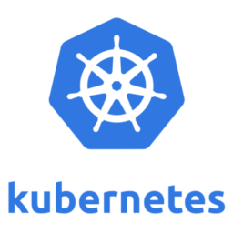

# K8s_cloud_deployment_toolset

This project contains a Taskfile.yaml used to automate the deployment and management of Kubernetes clusters across multiple platforms including Civo, Google Cloud Platform (GCP), and Kubernetes in Docker (KinD). The Taskfile defines tasks for network, firewall, and cluster creation, as well as cleanup and configuration tasks. 

## Key Features 
- Authentication and setup of CLI tools for Civo and GCP.
- Creation of networks, firewalls, and Kubernetes clusters.
- Automated cleanup of resources.
- Configuration tasks for optimal cluster management.
  
## Usage 
- Clone the repository.
- Update the Taskfile.yaml with your specific configurations.
- Execute the defined tasks using Task command.

This setup ensures a streamlined and automated approach to managing Kubernetes clusters, facilitating DevOps practices and infrastructure management.
